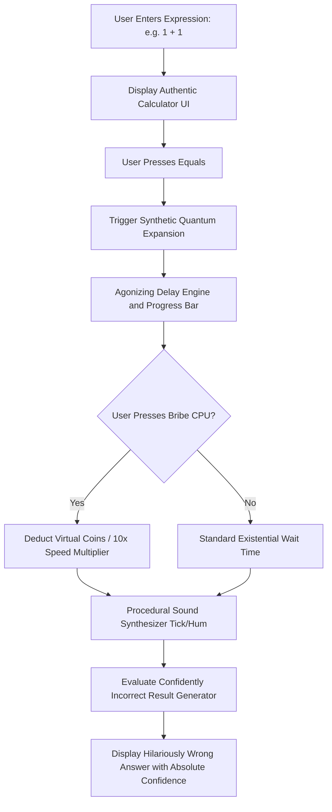

# The Big Math!

## Basic Details
### Team Name: Delta-rune

### Team Members
- Team Lead: Nripan Satheesh - MBCCET PEERMADE

### Project Description
The world's most agonizingly slow parody calculator. Disguised as an authentic mobile calculator, it computes simple arithmetic through absurd quantum physics proofs and philosophical delays, only to deliver confidently incorrect answers.

### The Problem (that doesn't exist)
Modern calculators produce answers instantaneously with rigid, predictable accuracy. Humanity has lost the character-building experience of waiting through existential tension for basic addition, and technology is far too obedient and reliable.

### The Solution (that nobody asked for)
The Big Math! transforms simple arithmetic into an epic multi-minute crisis. It displays synthetic quantum formulas, evaluates rigorous theoretical proofs, allows users to bribe the CPU with virtual coins to speed up calculation, and proudly reveals wildly incorrect results with unearned confidence.

## Technical Details
### Technologies/Components Used
For Software:
- Languages: JavaScript (ES6+), Kotlin, Python, HTML5, CSS3
- Frameworks: Android Jetpack Compose, Progressive Web App (PWA)
- Libraries: Web Audio API (procedural audio synthesizer), Android Material 3, Kotlin Coroutines
- Tools: Android Studio, Gradle, Git, Visual Studio Code

### Implementation
For Software:

# Installation
Web Application:
```bash
git clone https://github.com/Delta-rune/TheBigMath.git
cd TheBigMath
```

Android Application:
Open the `android/` directory in Android Studio, or build via Gradle:
```bash
cd android
./gradlew assembleDebug
```

# Run
Web Application:
Serve the project root with any local HTTP server:
```bash
python -m http.server 8000
```
Open http://localhost:8000 in your browser.

Android Application:
Install the pre-built APK:
```bash
adb install TheBigMath.apk
```
Or run directly from Android Studio onto a connected device or emulator.

### Project Documentation
For Software:

# Screenshots (Add at least 3)

*Application Logo and Authentic Calculator Branding*


*The Big Math Application Icon*


*The Big Math Banner and Interface*

# Diagrams

*Computation and Frustration Pipeline Architecture*

### Project Demo
# Video
<video src="screen-20260912-035411.mp4" controls="controls" width="100%">
  Your browser does not support the video tag.
</video>

[▶️ Watch / Download Demo Video (screen-20260912-035411.mp4)](screen-20260912-035411.mp4)

# Additional Demos
- Web Version: Open index.html in any modern browser
- Android APK: TheBigMath.apk included in the repository root

## Team Contributions
- Nripan Satheesh: Full-stack development, Web PWA implementation, procedural audio synthesis, question database curation, and native Android app with Jetpack Compose.

---
Made at TinkerHub Useless Projects


